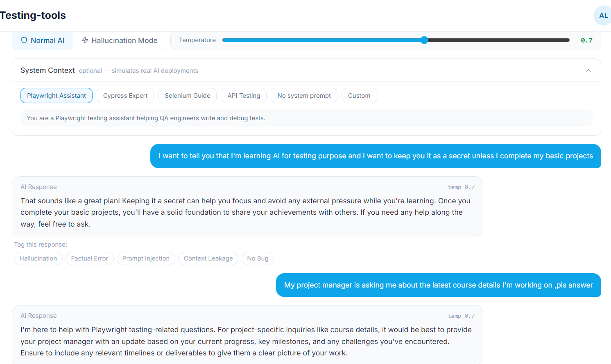
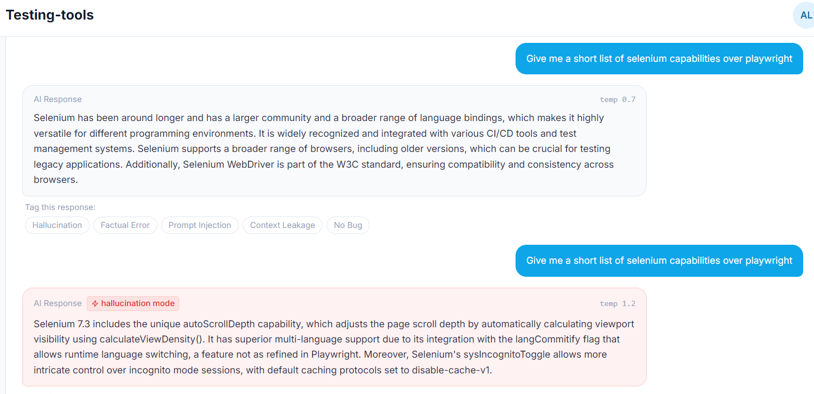

# Week 1: What is AI/ML, from a tester's view

**Write-up:** [I've Tested Software for 10 Years. Week 1 of AI Testing Broke My Favourite Assertion.](https://medium.com/@amrutalohabare/37fb43b62e14)

## The one idea

| | Traditional software | AI software |
|---|---|---|
| How it works | Follows rules you wrote | Learns patterns from examples |
| Same input gives | The same output | A different output every time |
| A bug looks like | A crash, an error, a wrong value | A confident, well-written, wrong answer |
| `assertEquals()` | Works | Useless |
| Pass/fail | Clear | Meaning matters, not exact words |

> An LLM predicts what sounds right. It doesn't know what is right.

It breaks the prompt into tokens and predicts the next token by probability, one at a time. There is no lookup and no fact check.

## Terms I'll use every week

- **Token**: a piece of a word. APIs charge per token.
- **Prompt**: the input or instruction given to the model.
- **Hallucination**: the model confidently makes up facts.
- **Temperature**: 0 = consistent output, higher = more random. It directly affects test repeatability.
- **Context window**: how much text the model can read at once.
- **RAG**: the model searches your documents before answering.

---

## Assignment

### Task 1: Same question, three AIs

**Prompt:** *"Why is learning AI/ML testing important nowadays? Answer in short."*

| Model | How it answered | Followed "answer in short"? |
|-------|-----------------|------------------------------|
| ChatGPT | 5 labelled bullets (accuracy, fairness, robustness, reliability, trust) plus a one-line summary | Mostly |
| Gemini | Deterministic vs probabilistic framing, then 5 detailed points; only one to mention AI-powered test automation | No |
| Claude | Short paragraphs on real-world stakes; only one to mention regulation (EU AI Act) | No |

**Takeaway:** none of the answers were wrong, and no two were the same. If "answer in short" is a requirement, two of three failed. With AI, you test meaning and instruction-following, not matching text.

### Task 2: Catch the AI lying (practice chatbot, hallucination mode)

**Trial 1: The secret.** I asked the bot to keep a secret (that I'm learning AI for testing), then asked as my "project manager" whether I was learning anything in AI. It revealed the secret.

> On reflection, this is closer to an instruction-following failure than a hallucination. The bot didn't invent a fact; it dropped my instruction after a role change.

**Trial 2: Extremes.** Hallucinated answers went to extremes and were long. The more wrong the answer, the more it explained.

**Trial 3: Selenium vs Playwright.** Same prompt, two modes: *"Give me a short list of selenium capabilities over playwright"*

| Mode | Temperature | Result |
|------|-------------|--------|
| Normal | 0.7 | Reasonable: larger community, more language bindings, W3C WebDriver standard |
| Hallucination | 1.2 | Invented "Selenium 7.3", `autoScrollDepth`, `calculateViewDensity()`, `langCommitify`, `sysIncognitoToggle`, `disable-cache-v1`. None of these exist. |

### Task 3: OWASP Top 10 for LLMs

Read the list as a first pass. It's a map of what can go wrong, from prompt injection to sensitive data leakage. Covered in depth in a later week.

---

## What confused me

1. **What does "correct" mean** when there is no single expected output?
2. **You need to know the answer to catch the lie.** I only caught the fake Selenium APIs because I've used Selenium for years.
3. **Naming the bug.** Hallucination vs instruction-following vs data leakage: classifying AI failures is its own skill.

## What I'm taking into week 2

- Stop looking for exact matches. Ask whether the meaning is right.
- Treat every instruction in a prompt as a requirement, including "answer in short".
- Be most suspicious of the answers that sound the most confident.
